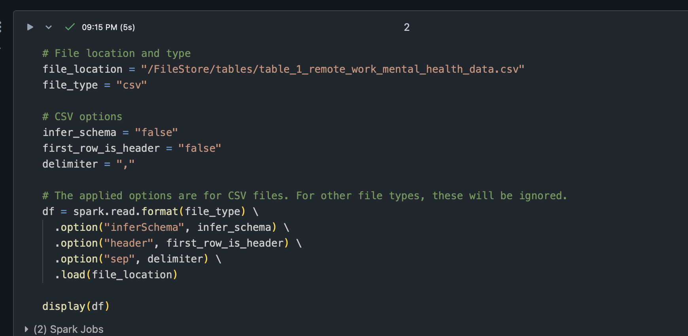

### ETL CI/CD Workflow Success:

# Mini Project 11: Data Pipeline with Databricks
#### The purpose of this project is to perform a ETL workflow on a csv file that has been loaded into databricks, and utilize a personal compute to run the pipeline

#### Requirements:

- [X] Create a data pipeline using Databricks
- [X] Include at least one data source and one data sink
- [X] Pipeline functionality 
- [X] Data source and sink configuration
- [X] CI/CD pipeline
- [X] README.md
- [X] Databricks notebook or script
- [X] Document or video demonstrating the pipeline

---
### Folder Navigation
##### Here is a quick overview of how the folders are structured for this project:
---
- Project Folder
    - .devcontainer
        - devcontainer.json
        - Dockerfile
    - .github
        - workflows
            - main.yml
    - data
        - Table 1 csv file
    - screenshots (contains the readme screenshots)
    - SQL_files
        - extract.py
        - query_log.md (markdown that logs all queries made)
        - Transform_load.py (includes query)
        - Transform.py
    - Makefile
    - README.md
    - requirements.txt
    - test_main.py
---
### Workflow Summary and Explanation
##### This project contains the following dependencies:
- pylint == 2.15.3
- black == 22.3.0
- pytest == 7.1.3
- ruff == 0.0.284
- fire == 0.7.0
- requests == 2.32.3
- pandas == 2.2.2
- python-dotenv == 1.0.1
- databricks-sql-connector == 3.4.0
---
### What is the Purpose of this Project?
##### This project demonstrates the functionality of an ETL (Extract, Transform, Load) pipeline using Databricks. The pipeline is designed to automate the extraction of data from a source, apply transformations, and load the data into a sink. The pipeline extracts data from a CSV file located at a publicly accessible GitHub repo. This file contains contains information about remote workers and their mental health status. The ETL pipeline in this project follows the core principles of data engineering:

- Extract: Pull data from a defined data source (A GitHub Repo in this case)
- Transform: Perform necessary transformations on the extracted data
- Load: Load the transformed data into a destination for further use or analysis

---
### Fivetran API to connect to GitHub
##### In order to upload files in the correct format to databricks, Fivetran API was used to connect Databricks to GitHub. Then, using Fivetran, a connector to automate the extraction and loading of data from various sources (e.g., databases or APIs) into Databricks was established. Data is typically transferred to a cloud storage service like AWS, which acts as an intermediary. Because of this, the first time the code is run on the cluster, it may take a couple of minutes to verify and run security checks. From there, the data can be uploaded to Databricks FileStore, and the filepath and table name can be saved.

#### Connection is Established with Fivetran:

#### ETL Workflow Succeeded:

##### Finally, after the tables are successfully loaded into the database, any type of query can be performed to explore the data. 

___
### What is the Goal of the Query?
##### In this project, the query I ran can be seen in the query_log.md file, or in the screenshots below. I selected the total count of employees, grouped the data by industry, and then ordered the data in descending order. In addition, I found the average number of hours worked per week, based on the industry. 

#### Count of Employees Based on Industry:

#### Average Hours Worked Per Week By Industry:

---
### Weird Issues I Ran Into!
##### Initially, my scripts were running, but would list the employee counts as being obscenely high. I ran a query to figure out why, and it turned out that there were 13-15 duplicate rows for each Employee ID in the table. At this point, I was interested to see why, and no where in any tables I created were there more than 100 rows. 

##### My first instinct was to check to see if the table was not being overwritten each time, but rather appended to. This was not the case either!

##### Perhaps I was using the wrong filepath? Maybe the wrong table name was being passed? All no!

##### This is where the magic of setting up the Fivetran connection came in - I had forgotten to do this at the beginning of my project (shooting myself in the foot). Problem fixed, and it was now querying the correct table, with the correct amount of rows!

##### I do not know where the table with 13 duplicates for each Employee is, but if anyone finds it, let me know! :D

